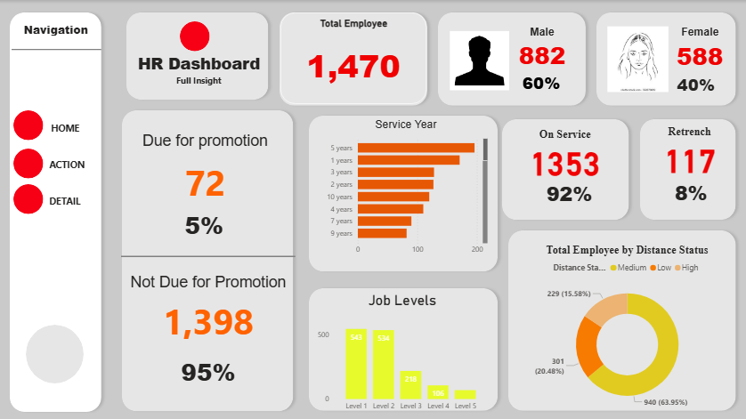

# HR Analysis Dashboard (Power BI)

## 📊 Dashboard Preview

## 🎯 Project Objective
The goal of this analysis was to provide the HR department with insights into employee trends. The dashboard focuses on key metrics such as **Attrition Rate**, **Headcount**, and **Employee Satisfaction** to help improve retention strategies.

## 🛠️ Data Process
* **Data Cleaning:** Used Power Query to remove duplicates, handle missing values in 'Years at Company', and format date columns.
* **Modeling:** Created a Star Schema connecting the Employee Fact table with Dimension tables (Department, Job Role, and Education).
* **DAX Measures:** Developed custom measures including:
  * **Attrition Rate %** = `(Total Attrition / Total Employees) * 100`
  * **Average Tenure**
  * **Employee Satisfaction Score**

## 💡 Key Insights (Sample)
* **High Attrition Departments:** Identified which departments (e.g., Sales or R&D) have the highest turnover.
* **Demographics:** Analyzed the age distribution and gender balance within the organization.
* **Retention Factors:** Discovered a correlation between "Monthly Income" and "Attrition," suggesting salary adjustments for mid-level roles.

## How to View
1. Download the `HR ANALYSIS.pbix` file.
2. Open it using **Power BI Desktop**.
